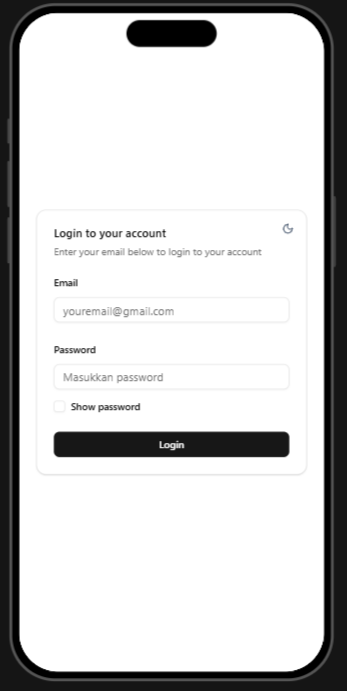

# 🔐 Web Authentication App (React + Express)

Website auth login dengan **React** untuk frontend dan **Express.js** sebagai backend

## 🚀 Cara menjalankan projek di lokal

- Download atau clone projeknya

```bash
  git clone https://github.com/ilmandwi24/auth-react-express.git
```

- Import atau load file auth_db.sql kemudian run sql


- Setelah itu buka folder backend-express dengan visual studio code 

- kemudian buat file .env dan isikan dengan data berikut
```env
PORT=3000
DB_HOST=localhost
DB_USER=root
DB_PASS=
DB_NAME=auth_db
JWT_SECRET=supersecretkey
```

- Berikutnya buka terminal pada visual studio code

- Install dependencies dengan perintah

```bash
  npm install
```

- Jalankan server untuk backend express

```bash
  npm run start
```

- Setelah server sudah jalan, selanjutnya buka folder frontend-react dengan visual studio code atau lainnya kemudian buka terminal

- Install dependencies dengan perintah

```bash
  npm install
```

- Jalankan server untuk react

```bash
  npm run dev
```

- buka url berikut dengan browser atau bisa lihat url local yang ditampilkan pada terminal

```bash
http://localhost:5173/
```

---

## ⚙️ Tech Stack

**Client:** React, React Router, React Hook Form, Axios, TailwindCSS,  Shadcn, Vite

**Server:** Node, Express, Bcryptjs, JSON Web Token (JWT), cookie-parser, dotenv, cors, mysql2

**Database:** MySQL

---

## 🧩 Project Architecture

```
[React App]  ⇄  [Express Server]  ⇄  [Database (MySQL)]
     ↑                  ↑
 (Frontend)         (Backend)
```

---

## 🌐 Demo Website Login

Berikut ini adalah data form login untuk demo auth login 
```
email : admin@gmail.com
password : admin
```

---

## 🖼 Screenshots





